# NX CAD моделирование в NX. Урок 1

**Введение, интерфейс, принципы работы, эскиз, втягивание**

Главное окно, направления координат в системе

- Разные вид изображения - правая кнопка мыши удерживать и появиться радиальное меню

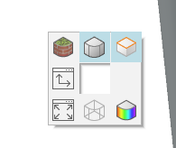

Зажать правае кнопка мыши и центральное - мы перемещаем модель

Нажать на колесо и двигать - поворот модели

- Востановить в первоначальное положения деталь

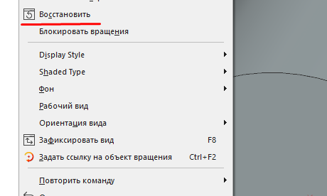

На каждой вкладе в целом свое контекстное менб которое зависит от контекста

Можем указать масштаб вида и укзать масштаб изображения

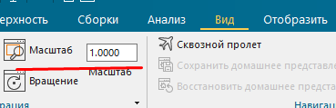

- Все настройки применяем сверху вниз

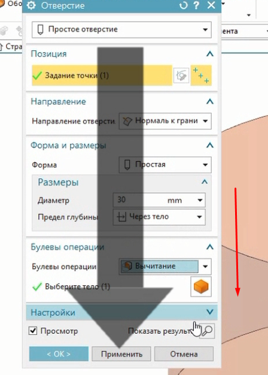 

- Можем менять камеру вида

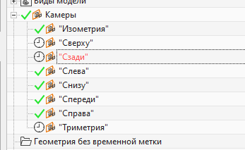 

- Можем вызвать каркасную модель и увидеть грани блока

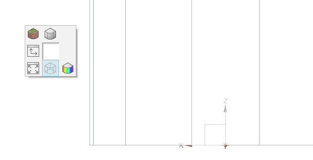 

- Можем выбрать как грань , так и компонент и т.д. в меню приоритетов настраиваем

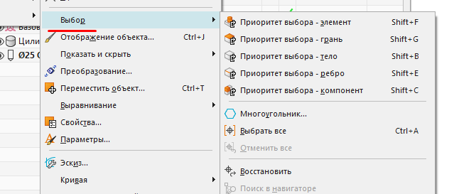

Команда F8 - выровнить до ближайщего вида

Все операции помнят своего родителя и к чему они были привязаны - ассоцивность

**Создаем эскиз**

Эскиз это связанные ограничениями и размерами кривые, находядящиеся в одной плоскости и воспринимаемые системой как одна команда.

- Можно зеркалить изображения

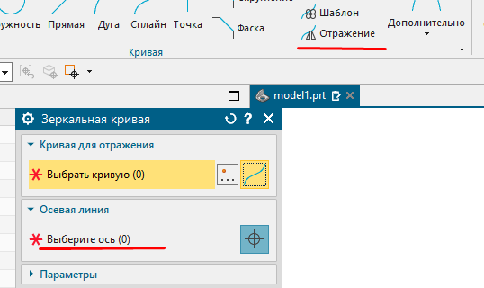

- Можно удлинять детили, обрезать и т.д.

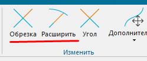

- Можно масштабировать с помощью размеров, дальше задаем размер и изменеям его , все сместиться относительно нового размера, когда ставим точки центровые на окружности можно просто навести на ребра и подтянеться центр

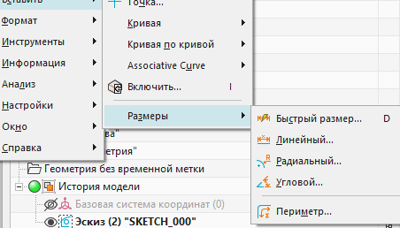

- Также вытягиваем элементы , задаем вектор и начало и конец куда, раст. и т.д.

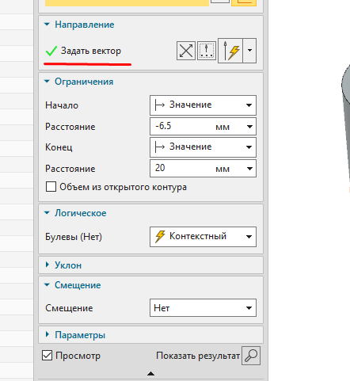

**теснения**

- Можем изменять тело с гранями делая типо теснения, то есть мы выбираем поверхность от которой будем потом строить вытягивание на уже текущей поверхности.

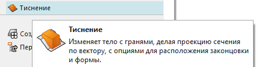

- Когда задаем тиснения лучше выбирать новую поверхность 

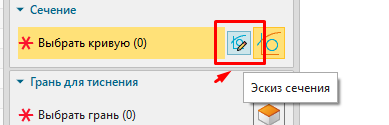

- Выбираем грани для вытягивание 

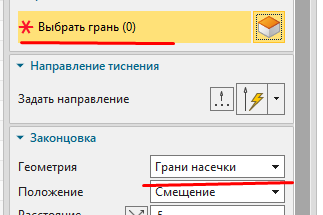

Можно нажать на ось слева и повращать модель 

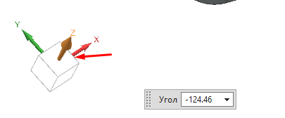

Можно окрыть новое окно с другой моделью одновременно, и множество других видов с несколькими моделями сразу

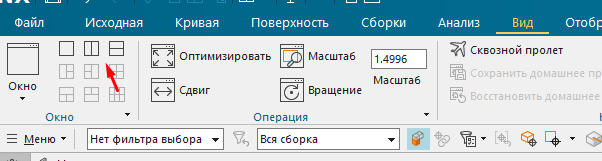

Можно выбрать разные условия выбора поверхностей

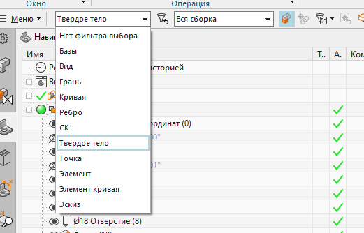

# Активные и вспомогательные кривые

Ограничения. Размеры. Вращение

1. Создание примерного контура

Рисовать профиль - неразрывно вести контур проофиля, тоесть вести прямые линии и дуги создавая профиль.

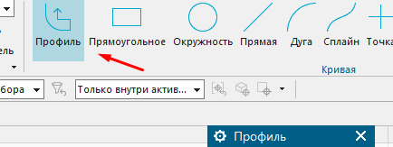

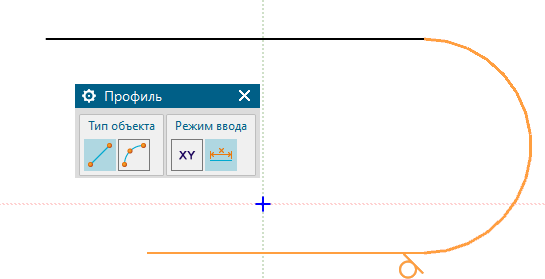

Можем перемещать профиль и менять его размеры просто выделяя точки и меняем его масштаб

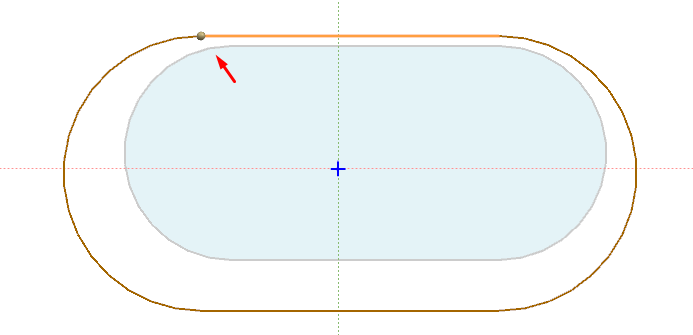

Чтобы перемещать профиль эскиза - нажимаем на ослабить отношения

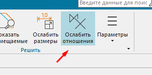

Создать совпадения чтобы переместить точки - ссотнести их

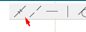

9,35...